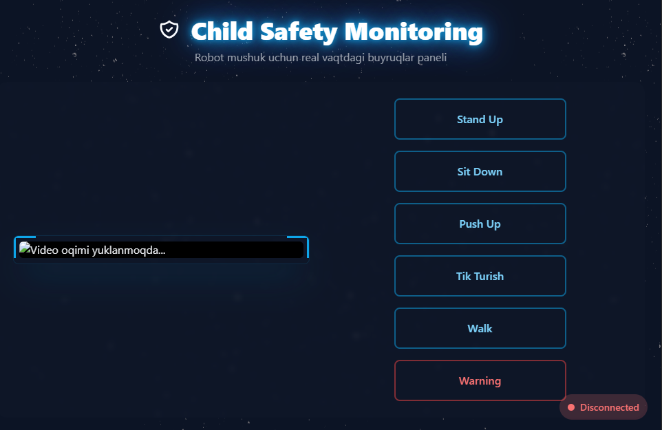

# 🤖 Smart Security Robot – Fire & Intruder Detection with Neiron Cat (ESP32)

## 📌 Loyihaning maqsadi
Bu loyiha **uy xavfsizligini ta’minlash** uchun ishlab chiqilgan.  
📍 Ayniqsa **uyda yolg‘iz qolgan bolalar** yoki oilaviy xavfsizlik uchun juda qulay.  

Asosiy imkoniyatlari:  
- 🔥 **Olov va tutunni aniqlash** (AI modeli yordamida)  
- 📲 **Telegram botga ogohlantirish yuborish** (rasm bilan birga)  
- 🤖 **Neiron mushuk robot ** turli harakatlar bajaradi  
  - 🔊 **Buzzer orqali ovozli ogohlantirish** beradi  
- 🌐 **Flask web interfeysida**:  
  - 🖥️ Real-time video oqim  
  - 🎛️ Robotni tugmalar orqali boshqarish (o‘tirish, turish va h.k.)  
- 📡 **ESP32 WiFi tarmog‘i** orqali Flask bilan to‘g‘ridan-to‘g‘ri aloqa  

---

## ⚙️ Texnologiyalar

- **Python 3.10+**  
- **OpenCV** – kamera oqimi va rasmni qayta ishlash  
- **YOLO / Ultralytics** – olov va tutunni aniqlash  
- **Flask** – web interfeys (boshqaruv tugmalari + video oqim)  
- **Requests** – Telegram va ESP32 bilan aloqa  
- **ESP32** – servo motorlar va buzzer boshqaruvi  
- **Neiron Cat** – 11 ta servo bilan mushuk shaklidagi robot  

---

## 🐾 Neiron Robot integratsiyasi

- ESP32 mikrokontrolleri **WiFi tarmog‘i yaratadi**  
- **11 ta servo** motor orqali oyoq, bo‘yin va dum harakatlari boshqariladi  
- Flask web interfeysidan quyidagi amallar bajariladi:  
  - ⏩ Turli harakatlar (erkalanish / yurish / push up / xavfdan ogohlantirish)
- **Buzzer** xavf aniqlanganda ovoz chiqaradi  
- Flask xavf signalini ESP32 ga yuboradi → mushuk robot ovoz bilan ogohlantiradi  

---

## 📂 Loyiha tuzilishi

## 🔧 O‘rnatish va ishga tushirish

1. Repository’ni yuklab oling:
2. Esp32 mikrokontrollerga robot_code papka ichidagi nybble_wifi_ai.ino faylini yuklang
3. Python kutubxonalarini yuklab oling va congif.py faylini yarating
```python
TELEGRAM_BOT_TOKEN = "bot_token_kiriting"
TELEGRAM_CHAT_ID = "chat_id_kiriting"

def get_token():
    return TELEGRAM_BOT_TOKEN

def get_chat_id():
    return TELEGRAM_CHAT_ID
```
5. Loyihani serverga yuklang
6. app.py faylini ishga tushiring va Esp32 wifi tarmog'iga ulaning
7. http://SERVER_IP:8000/ serverda mushuk boshqaruvi va video ochiladi
8. Testlab ko'ring xavfni aniqlasa Tg bot va mushuk ogohlantirish beradi 🔊

--- 

## 📷 Loyihadan suratlar

Robotning umumiy ko‘rinishi:


Web interfeys:



---
## ✍️ Muallif

- Loyiha muallifi: https://github.com/Yasmina1602  
- Aloqa: xabibovayasmina@gmail.com  

---
MIT License

Copyright (c) 2025 Yasmina1602

Permission is hereby granted, free of charge, to any person obtaining a copy
of this software and associated documentation files (the "Software"), to deal
in the Software without restriction, including without limitation the rights
to use, copy, modify, merge, publish, distribute, sublicense, and/or sell
copies of the Software, and to permit persons to whom the Software is
furnished to do so, subject to the following conditions:
...
